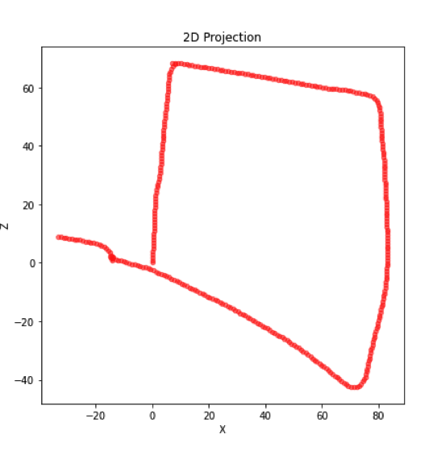
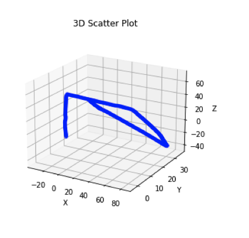

# Visual Odometry Project

This project involves processing a sequence of frames captured by a camera mounted in a car (Oxford_dataset_reduced). The camera's intrinsic parameters are extracted using a provided script. The sequence of frames is then used to perform a series of operations that include identifying shared keypoints across frames, estimating the fundamental and essential matrices between frames, and decomposing the essential matrices into translation and rotation parameters. The final step of the project is to reconstruct and visualize the 3D trajectory of the camera. This process effectively maps the camera's path, providing a detailed view of its journey.

## Steps

#### 1
Used the ReadCameraModel function to import the model, using fx, fy, cx, and cy to create the intrinsic matrix as a numpy array.

#### 2
Loaded the images in from the Oxford dataset, and sorted them in order. Created a loop that iterates over each of the 376 images reading in the current and the next image on each iteration. Used cv2.imread to get the bayer encoded images, and converted them to color images using cv2.COLOR_BayerGR2BGR. Then used UndistordImage and the LUT from RealCameraModel to undistort the images.

#### 3
Used cv2.SIFT_create() SIFT keypoint algorithm to get keypoints and descriptions for each image. Used cv2.BFMatcher brute force matcher to find matches between the successive frames. Then only kept the best 250 matches sorted by distance.

#### 4
Used the keypoints for both images and cv2.findFundamentalMat to find the fundamental matrices for each image. Did this by reshaping the keypoints to work with the function, and using cv2.FM_RANSAC.

#### 5
Calculated the essential matrix by multiplying the intrinsic matrix with the fundamental matrix.

#### 6
Used recover pose with the essential matrix, keypoints, and intrinsic matrix to get the rotation and matrices translation vectors. Then appended these to a list for further use.

#### 7

Created a matrix to cumulatively store the movement between all of the images. Initializes three empty lists,to store the camera positions along the X, Y, and Z axes, respectively.

#### 8

Looped over the sequence of images and computed the transformation matrix T between camera i and camera i+1. This transformation matrix combines the rotation matrix and the translation vector using np.hstack() and np.vstack().

#### 9

Multiplied the transformation matrix and the cumulative matrix, storing it back in the cumulative matrix and updating the camera position for each iteration.

#### 10

Computed the inverse of the transformation matrix and mulitplied the inverse transformation matrix with the origin array, [0, 0, 0, 1]. The resulting transformed vector represents the camera center position relative to the current image.

#### 11

Appended the X, Y, and Z coordinates of the camera center position to the respective lists. And graphed.

### 2D and 3D Projection Results

